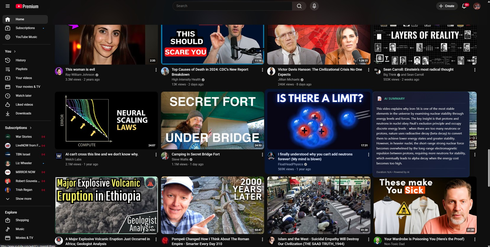

# AI YouTube Video Summarizer

A Chrome extension + local backend that generates AI-powered summaries of YouTube videos on hover. Hover over any video thumbnail and get an instant summary — then optionally fact-check it with one click.



## Features

- **Hover to Summarize** — Hover over any YouTube thumbnail for ~1 second to get an AI summary
- **Fact-Check Validation** — Click "Check Validity" to have Claude Opus cross-reference the summary against the original transcript
- **Sidebar & Recommendation Support** — Works on homepage thumbnails, search results, sidebar recommendations, and playlist panels
- **Crash-Resilient Backend** — yt-dlp runs in isolated subprocesses so crashes don't take down the server
- **Rate Limiting & Caching** — In-memory transcript cache and 2-second rate limiting between yt-dlp calls prevent 429 errors
- **Duplicate Request Protection** — Concurrent requests for the same video are deduplicated
- **Production WSGI Server** — Uses Waitress instead of Flask dev server for stability
- **Privacy-First** — Runs entirely locally; your data never leaves your machine (except API calls to Anthropic)
- **No YouTube API Key Needed** — Uses yt-dlp for reliable transcript fetching

## Architecture

```
┌─────────────────┐     ┌─────────────────┐     ┌─────────────────┐
│ Chrome Extension │────▶│  Flask Backend  │────▶│   Claude API    │
│  (Hover detect) │     │  (localhost)    │     │  (Summarize)    │
└─────────────────┘     └─────────────────┘     └─────────────────┘
        │                       │                        │
        │                       ▼                        │
        │                ┌─────────────────┐             │
        │                │ yt-dlp subprocess│             │
        │                │ (Get transcript) │             │
        │                └─────────────────┘             │
        │                                                │
        └── "Check Validity" ──────────────────▶ Claude Opus 4.6
                                                 (Fact-check)
```

## Requirements

- Windows 10/11
- Python 3.8+
- Chrome, Brave, or Edge browser
- Anthropic API key ([get one here](https://console.anthropic.com/))

## Installation

### Option 1: Easy Installer (Recommended)

1. Download the [latest release](../../releases)
2. Extract the ZIP file
3. Double-click `INSTALL.bat`
4. Follow the prompts

### Option 2: Manual Installation

1. **Clone the repository:**
   ```bash
   git clone https://github.com/Powellga/AI-Youtube-Video-summarizer.git
   cd AI-Youtube-Video-summarizer
   ```

2. **Set up Python environment:**
   ```bash
   cd backend
   python -m venv venv
   venv\Scripts\activate
   pip install -r requirements.txt
   ```

3. **Create config file:**
   ```bash
   # Copy the example and add your API key:
   cp config.example.json config.json
   ```
   Edit `config.json`:
   ```json
   {
     "anthropic_api_key": "sk-ant-api03-YOUR-KEY-HERE",
     "model": "claude-haiku-4-5-20241022"
   }
   ```

4. **Install Chrome extension:**
   - Open Chrome and go to `chrome://extensions/`
   - Enable "Developer mode"
   - Click "Load unpacked"
   - Select the `extension` folder

## Usage

1. **Start the backend server:**
   ```bash
   cd backend
   venv\Scripts\python.exe server.py
   ```

2. **Browse YouTube** — Go to youtube.com

3. **Hover over any video thumbnail** — Wait about 1 second

4. **See the summary!** — A tooltip appears with the AI-generated summary

5. **Fact-check it** — Click "Check Validity" in the tooltip to have Claude Opus analyze the summary's accuracy against the original transcript

## Project Structure

```
AI-Youtube-Video-summarizer/
├── backend/
│   ├── server.py              # Flask backend with yt-dlp subprocess isolation
│   ├── requirements.txt       # Python dependencies
│   └── config.example.json    # Example config (copy to config.json)
├── extension/
│   ├── manifest.json          # Chrome extension manifest (MV3)
│   ├── background.js          # Service worker with retry logic
│   ├── content.js             # YouTube page injection & tooltip UI
│   ├── styles.css             # Tooltip & validation styling
│   └── icons/                 # Extension icons
├── systray/
│   ├── tray_app.py            # pystray controller (start/stop server, config UI)
│   └── requirements.txt       # pystray, Pillow, psutil
├── installer/
│   └── install.ps1            # Windows installer script
├── INSTALL.bat                # Easy installer launcher
└── README.md
```

## Configuration

Edit `backend/config.json`:

```json
{
  "anthropic_api_key": "sk-ant-api03-YOUR-KEY-HERE",
  "model": "claude-haiku-4-5-20241022"
}
```

**Available models for summarization:**
- `claude-haiku-4-5-20241022` — Fast, low cost (recommended for summaries)
- `claude-sonnet-4-20250514` — Higher quality, moderate cost

**Note:** The "Check Validity" feature always uses Claude Opus for maximum accuracy in fact-checking.

## What's New (v2.5)

- **Server stability overhaul** — Fixed server freezing after a few summarizations. Root cause: stuck yt-dlp threads would exhaust the thread pool and block all request handling
- **Subprocess isolation with hard kill** — yt-dlp now runs via `Popen` with a 20-second timeout. On timeout, the process is forcibly killed instead of left dangling
- **Request deduplication** — Duplicate hover events for the same video share a single subprocess instead of each blocking a server thread
- **16 Waitress threads** — Increased from 6 to handle concurrent requests without exhaustion
- **60-second Anthropic API timeout** — Claude API calls now have a hard timeout so they can't hang forever
- **Content script message timeouts** — Extension no longer spins forever if the service worker dies mid-request (45s timeout for summaries, 90s for validation)
- **Fetch timeouts in service worker** — All backend calls from the extension have explicit timeouts (Brave-compatible AbortController pattern)
- **Continue in Claude** — After validation, click to copy full context (video URL, summary, validation) to clipboard and open claude.ai

### Previous (v2.4)

- **Fact-Check Validation** — "Check Validity" button sends the summary + transcript to Claude Opus for cross-reference analysis with color-coded verdicts (green/yellow/red)
- **Crash-Resilient Backend** — yt-dlp runs in isolated subprocesses; if it crashes, the server stays up
- **Sidebar Video Support** — Summaries work on homepage, search results, sidebar recommendations, and playlist panels
- **Production Server** — Waitress WSGI server instead of Flask dev server
- **Persistent Tooltip** — Tooltip stays visible when you hover over it (so you can click the Validate button)
- **Rotating Log Files** — Logs written to user home directory with 5MB rotation

## Cost Estimate

- ~$0.001 per summary with Haiku
- ~$0.02 per validation with Opus
- Light usage (50 summaries + 10 validations/day): ~$8/month
- Heavy usage (200 summaries + 50 validations/day): ~$35/month

## Troubleshooting

### Server won't start
```bash
# Make sure you're in the backend directory with venv activated
cd backend
venv\Scripts\activate
python server.py
```

### "Extension error occurred"
- Check that the server is running (you should see "Starting with waitress on http://127.0.0.1:5000")
- Check Chrome DevTools console for errors (F12)

### No transcript available
- The video might not have captions enabled
- Try a different video

### API key errors
- Verify your API key is correct in `config.json`
- Make sure you have API credits at console.anthropic.com

### Server crashes or freezes
- Check `~/YouTubeSummarizer_server.log` for error details
- The server isolates yt-dlp in killable subprocesses and deduplicates concurrent requests, so freezes from stuck yt-dlp calls should no longer occur
- If the server stops responding, kill the process and restart - the system tray app will auto-restart it

## Tech Stack

- **Backend:** Python, Flask, Waitress, yt-dlp
- **AI:** Anthropic Claude API (Haiku for summaries, Opus for validation)
- **Extension:** Chrome Manifest V3, vanilla JavaScript
- **Transcript:** yt-dlp with subprocess isolation

## License

MIT License - feel free to use, modify, and distribute.

## Acknowledgments

- [yt-dlp](https://github.com/yt-dlp/yt-dlp) - Reliable YouTube data extraction
- [Anthropic](https://anthropic.com) - Claude AI API
- [Waitress](https://docs.pylonsproject.org/projects/waitress/) - Production WSGI server

## Author

**Gregg Powell**
- GitHub: [@Powellga](https://github.com/Powellga)
